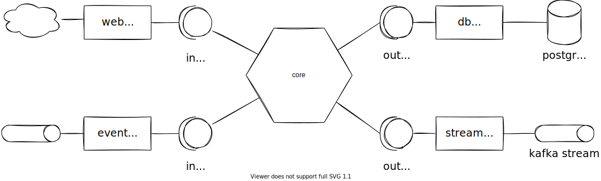
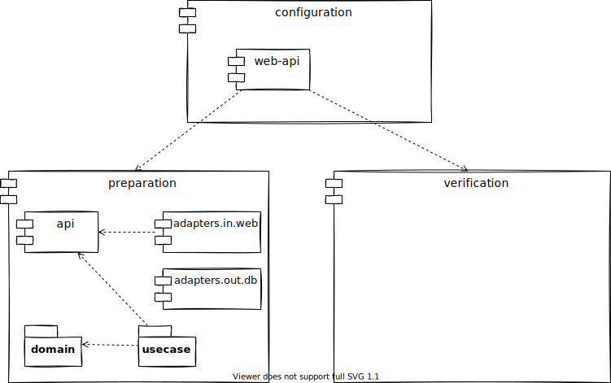

# DMS Hex
Java&Spring based backend with Hexagonal Architecture applied.

## Introduction

Hexagonal architecture places most essential domain logic centrally and isolates all technical aspects via ports and adapters.
These details include:

* persistence technology,
* messaging technology,
* web technology.

This approach to the architecture has the following advantages:

* essential domain logic is independent on applied technology (as technology tend to change more often than domain),
* promotes domain-first design also called a "screaming architecture".

## How to build and run

You need Java 17 to build and run this project.

While on CLI please type `gradlew build` to build the project.

While on CLI please type `gradlew :configuration:web-api:bootRun` to run the SpringBoot application.

## Layout of this project

On the top level of this project we place subdomains (or bounded contexts) modules such as:

* preparation,
* verification.

We also place here a special module `configuration` that contains applications composed of subdomains.

### Layout of subdomain

Subdomain consists of its domain logic which resides directly in `src` folder of the module.
Domain logic code includes:

* entities (aka domain objects),
* domain exceptions indicating errors.

We also place `usecase` package that contains use cases.
Use case encapsulates business logic and basically splits into two categories:

* query use cases that are not changing state of the system and just delivering data,
* command use cases that are changing state of the system and may additionally deliver some data.

Essentially, a use case is a class with just one public method, namely `apply` for command UCs and `queryBy` for query UCs.
Use cases communicate with external world via ports, that reside in dedicate package.
We use separate port per function approach.

Because this is an "api first" project, we place API of the subdomain into a dedicated module, namely `api`.
API consists of data structure definitions for:

* commands (that is a payload of the command use cases),
* queries (that is a parameters of the query use cases),
* query models (that is a response models from use cases).

API module is important, because it denotes the API of the application.
That is, we expose these data types directly to the inbound interfaces such as REST and/or messaging.
This is a simplification of the hexagonal architecture, which usually, in its most traditional form, separates between these two worlds and introduce mapping.

In `adapters` we store modules that implement ports.

## Testing

Domain logic (entities, use cases) are to be solely unit tested, with usage of Mockito to mock ports.

Adapters should be tested on integration level only, using testing spring context, in-memory database, and web context.
It does not make sense to unit test adapters.

## Gradle plugins

We reuse gradle configurations via plugin system.
This project declares additional plugins in `buildSrc/src/main/groovy` folder.

We have the following plugins to be used in modules:

* `dmshex.java` - plain Java module with Jupiter, Lombok and ArchUnit available.
* `dmshex.domain` - domain logic that includes `dmshex.java` plus JPA API (to be used in entities) and Spring/TX essentials (to be used in use cases).
* `dmshex.adapter.in.web` - includes `dmshex.java` plus Spring Web (MVC) dependencies.
* `dmshex.adapter.out.db` - includes `dmshex.java` plus Spring Data and JPA dependencies.

These plugins are examples that can be extended depending on needs.
